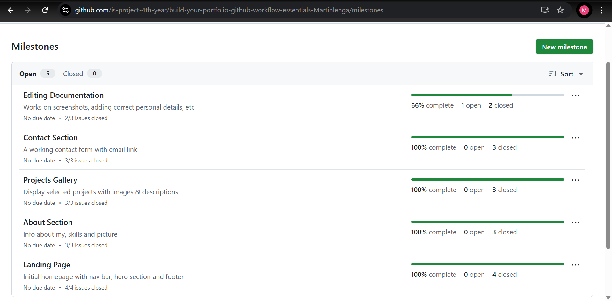
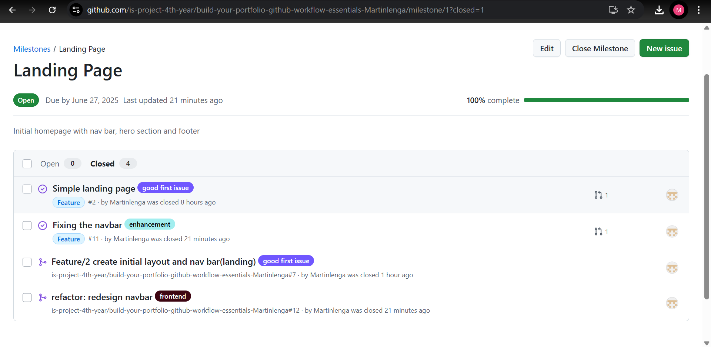
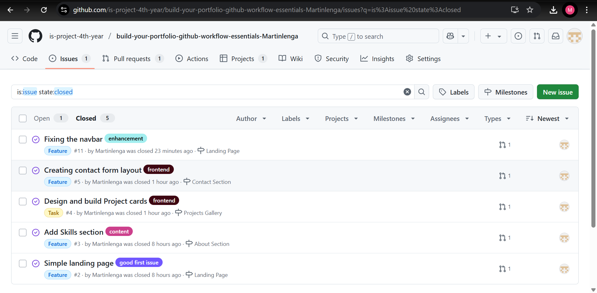
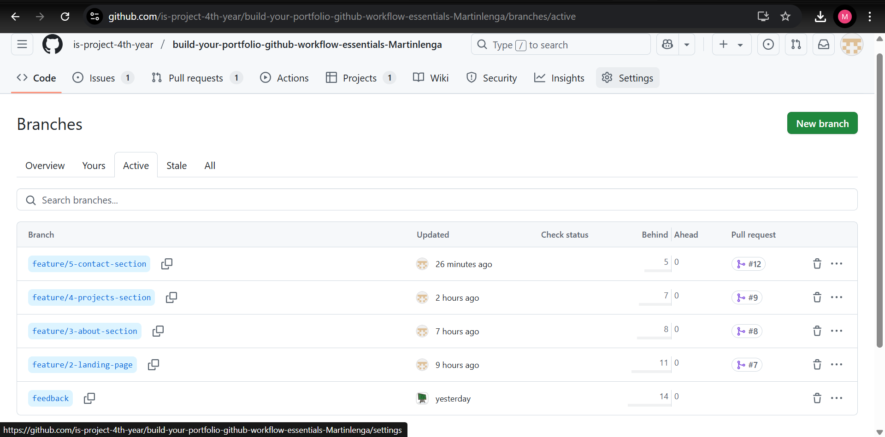
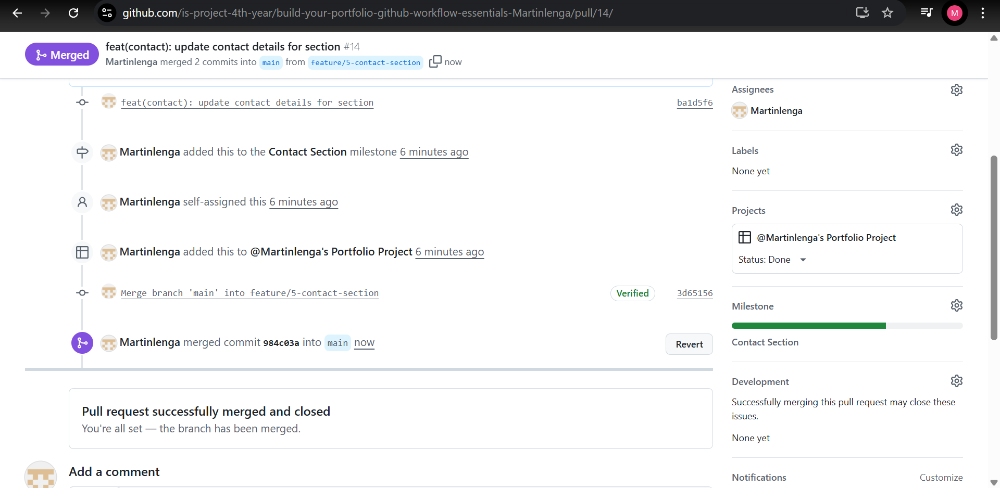
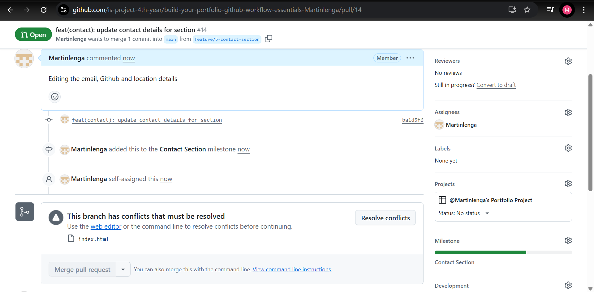
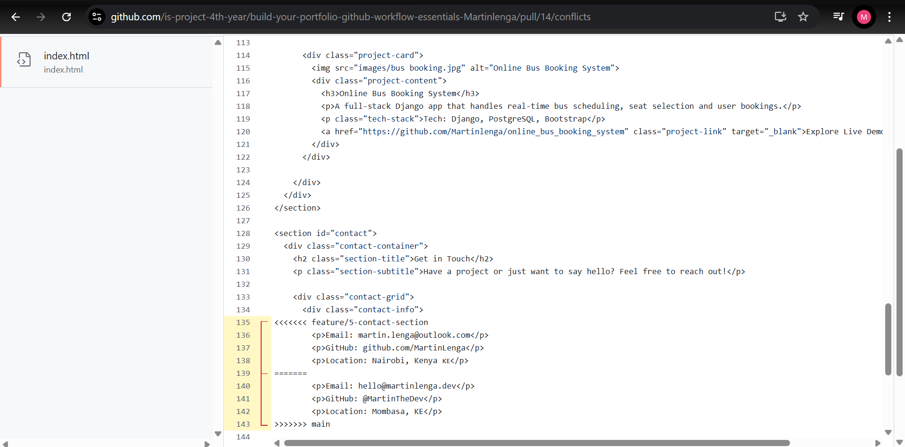
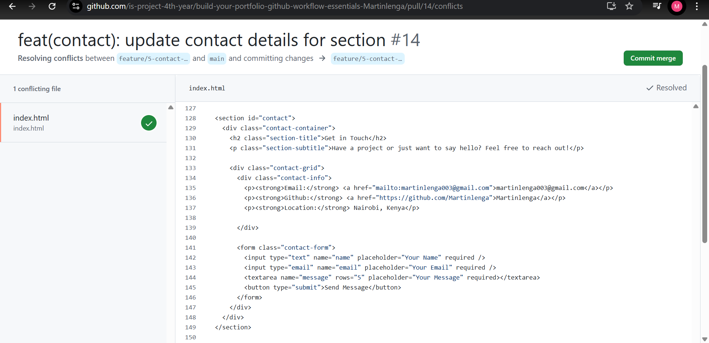

# Personal Portfolio Documentation
## 1. Student Details

- **Full Name:** Martin Lenga Mwapahe
- **Admission Number:** 150160  
- **GitHub Username:** Martinlenga  
- **Email:** martin.mwapahe@strathmore.edu

---

## 2. Deployed Portfolio Link

- **GitHub Pages URL:**  [Live Portfolio Link]( https://is-project-4th-year.github.io/build-your-portfolio-github-workflow-essentials-Martinlenga/)

---

## 3. Learnings from the Git Crash Program

### Concept 1: GitHub Project Boards  
**Expectation:** Thought it was a project management tool used only by large teams.  
**Reality:** It’s basically a Kanban board — easy to drag issues and visualize tasks.  
**Impact:** Helped me break my portfolio into smaller tasks and track progress easily.

### Concept 2: Commit Conventions  
**Expectation:** Seemed like something advanced or optional.  
**Reality:** Turned out to be a clear way to track changes and make commits readable.  
**Impact:** Helped me stay organized when working with multiple branches and features.

### Concept 3: Pull Requests  
**Expectation:** I thought PRs were only for big open-source projects.  
**Reality:** PRs made it easy to review changes even as a solo dev.  
**Impact:** Allowed me to track features, simulate merge conflicts and work neatly.

### Concept 4: Merge Conflict Resolution  
**Expectation:** Thought it would be scary or technical to resolve.  
**Reality:** It's just a matter of reading changes carefully and choosing what stays.  
**Impact:** Gave me confidence to handle Git in real-world scenarios.

---

## 4. Screenshots of Key GitHub Features
### A. Milestones  
#### Screenshot of All Milestones  
  
Shows all the milestones created for the project — each representing a major section like Landing Page, About Section, Project Gallery, etc.

#### Screenshot of Milestone with Issues  
  
Here, you can see how individual issues were linked to specific milestones for better tracking and planning.

### B. Issues  
#### Screenshot of Open Issues  
  
This shows a list of currently open issues — active tasks that are yet to be completed for the portfolio.

#### Screenshot of Closed Issues  
  
The closed issues represent tasks that were completed and successfully merged, showing consistent progress throughout development.

### C. Project Board  
#### Screenshot of Project Board  
  
This board follows a To Do → In Progress → Done workflow. It visually maps out the project tasks and shows how I tracked my progress.

### D. Branching  
#### Screenshot of Branching  
  
Each task or feature was developed on a dedicated branch following naming conventions like `feature/3-about-section` — promoting clean, conflict-free development.

### E. Pull Requests  
#### Screenshot of All Pull Requests  
  
All pull requests made throughout the project are listed here. They show the progression from feature development to final merge.

#### Screenshot of Pull Request & Merge Successful  
  
This shows a successfully merged pull request, complete with a meaningful title, description and linked issue for traceability.

### F. Merge Conflict Resolution  
#### Screenshot of Merge Conflict  
  
This screenshot shows a merge conflict that occurred when trying to combine changes from two branches that edited similar files.

#### Screenshot of Before Conflict Resolution  
  
This shows the unresolved state where Git flagged the conflict in the file. The affected lines are marked with conflict indicators.

#### Screenshot of Resolved Conflict  
  
After carefully reviewing the differences, I manually resolved the conflict, committed the changes and successfully merged the code.

---

### Final Note
This documentation reflects how I used GitHub not just for version control, but as a complete project management toolkit — from planning and organizing to resolving conflicts and deploying a professional portfolio.
